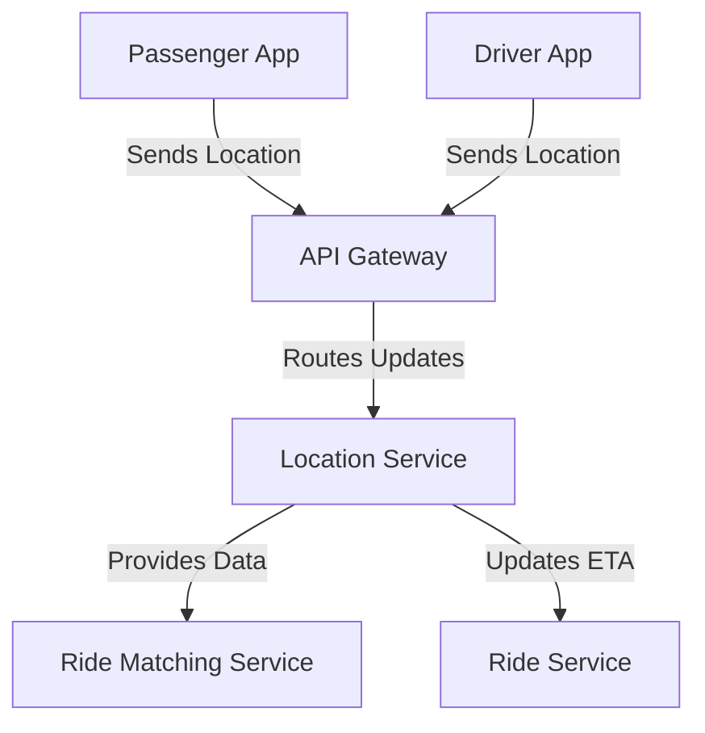

# Location Service

The Location Service is a microservice in the ride-booking system that handles real-time location updates for drivers and riders, using geospatial indexing for efficient proximity searches.

## Key Features
- **Real-Time Tracking**: Updates and stores location data for drivers and riders.
- **Geospatial Indexing**: Uses techniques like GeoHash to optimize proximity searches.
- **Route Optimization**: Integrates with mapping APIs for accurate navigation and ETA calculation.

## Architecture Diagram

## Interaction with Other Services
The Location Service is integral to tracking and matching functionalities, interacting with:
- **API Gateway**: Receives location updates from Passenger and Driver Apps for processing.
- **Ride Matching Service**: Supplies location data to enable matching of nearby drivers with passengers.
- **Ride Service**: Provides location-based data for fare estimation and ride tracking, including ETA updates.

