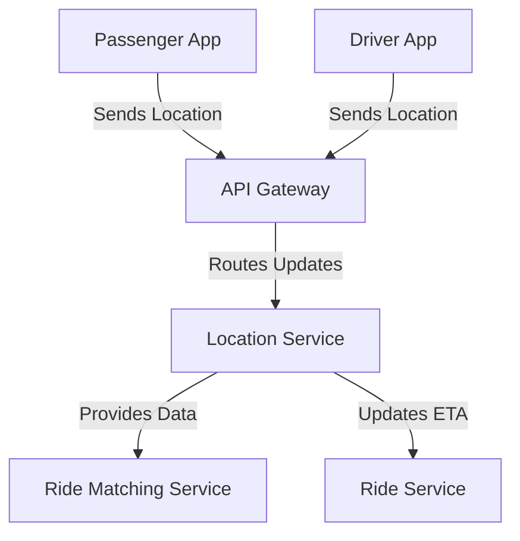

# Location Service

The Location Service handles real-time location updates for drivers and riders, using geospatial indexing for proximity searches in the ride-booking system.

## Key Features
- Real-Time Tracking
- Geospatial Indexing
- Route Optimization

## Recommended Tech Stack
- **Runtime**: Node.js for managing real-time updates [1][3].
- **Database**: PostgreSQL with PostGIS for geospatial data; Redis for caching [1][4].
- **Mapping API**: Google Maps API or Mapbox for route optimization [3][4].
- **Real-Time Communication**: WebSockets or MQTT for location streaming [3].

## System Design Structure
- **Location Updater**: Receives driver/rider location data via API Gateway.
- **Geospatial Engine**: Uses GeoHash or S2 Geometry for proximity searches.
- **Route Calculator**: Integrates mapping APIs for ETA and navigation.
- **Cache Layer**: Redis stores frequent location queries for speed.
- **Storage Layer**: PostGIS stores historical location data.

## Architecture Diagram

## Interaction with Other Services
The Location Service supports tracking and matching:
- **API Gateway**: Receives location updates from client apps.
- **Ride Matching Service**: Supplies location data for driver matching.
- **Ride Service**: Provides ETA and tracking data for rides.

